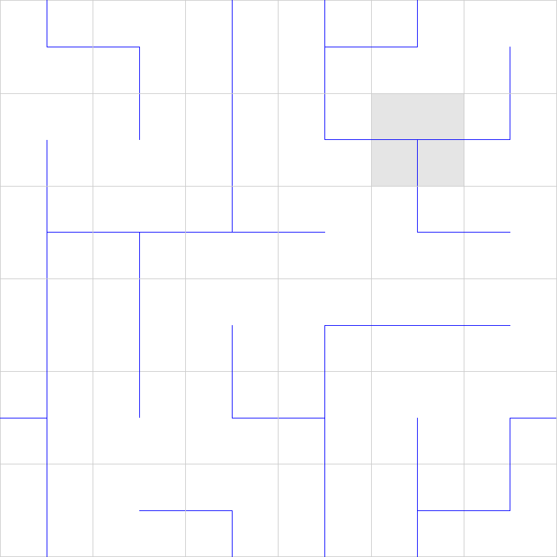

Implementation of the game [Net](https://www.chiark.greenend.org.uk/~sgtatham/puzzles/js/net.html) from [Simon Tatham's Portable Puzzle Collection](https://www.chiark.greenend.org.uk/~sgtatham/puzzles/) in Haskell.

* Press 'r' to randomly rotate all tiles
* right click on a tile to rotate it left
* left  click on a tile to rotate it right

